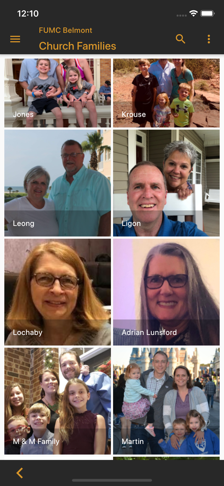

*A new way to remember, connect, and engage.*
<h1 class="perm-marker">Features</h1>

You know that face but you just can't remember the name to go with it. Here's how NameTaggle helps:

##### Individual Profile

  

    

      

        You create an individual profile with your personal and contact information as well as a picture and optional note. You're always in control of what information is shared with your organization(s) and each type of user within them. If one of your organization's leaders already started a profile for you, you can claim ownership of it and take over from there. <b>At this time we don’t allow individuals younger than 13 to create profiles, but parents can create them for their children.</b>
      

      

        
      

      
      
        
      

    

  

##### Multiple Organizations

  

    

      NameTaggle allows you to easily maintain connections within multiple organizations. You maintain only one profile and can control exactly which information gets shared with each organization. This way, you can easily switch from viewing members of your Parent Teacher Association Board to finding the phone number for the neighbor whose dog is loose while still keeping your contact information as private as you choose.
      

      

        
      

      
      
        
      

    

  

##### Groups

  

    

      Every organization has subsets of people that do things together - we call these "groups." For a business, this might be workplace locations or organizational units (like Marketing or Finance). Religious organizations may organize Sunday School classes or committees as groups. Users within your organization can join or show interest in notifications from as many of your groups as they want, making it easy for people to connect and stay engaged.
      

      

        
      

      
      
        
      

    

  

##### Families

  

    

      Some organizations, like neighborhoods and religious organizations, also keep track of families. NameTaggle allows you to create a family profile, with shared contact information a family picture and caption. As always, you're in control of which organizations can access that information.
      

      

        
      

      
      
        
      

    

  

##### Interests

  

    

      Adding Interests is a way to keep track of information about topics and events that may relate to multiple Groups. In an office, this could include "Socializing After Work" events or "Service Opportunities." Religious organizations use the feature for people who want to be notified of things like "Musical Performances," "Volunteers Needed," or "Events for Children."
      

      

        
      

      
      
        
      

    

  

##### Administrative Controls

  

    

      Users with Administrative privileges can control what features are available to users and user groups in the organization.
    

    

      
    

    
      
      
    

  

##### Printable Directory

  

    

      Administrators can generate PDF directories for printing and sharing electronically. They can also upload previous directories to keep everything in one place.
      

    

      
    

    
      
      
    

  

##### Sticky Notes

  

    

      Sticky Notes are always private and visible only to the user who created them. This gives you a place to jot down details you want to remember without worrying that they'll be unintentionally shared with others. This is a great way to keep track of information that people didn't include in their profile but that you want to remember. You can also search on the content of your sticky notes, so it's easy to find the person you tagged as "a master chef!"
      

      

        
      

      
      
        
      

    

  

##### Notifications *NEW*

  

    

      Our notification system allows you to get the message across without pestering your users. NameTaggle provides a daily summary of how many new messages you have waiting to read, each with a built-in date when they'll automatically clear from your inbox.
      

      

        
      

      
      
        
      

    

  

