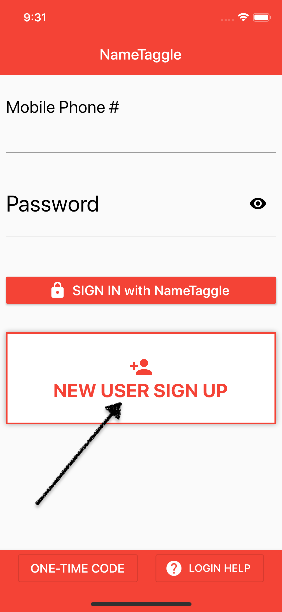

<h1 class="perm-marker">Install & Signup B</h1>

 
##### Who should use this procedure?
New users that would like step-by-step instructions to install and setup NameTaggle.

 
##### What should I have ready before I start?
Before you begin make sure you have:
<ul class="release-bullets">
<li> Your smart phone (NameTaggle will send you a verification text message).</li>
<li> A picture of yourself (You can crop a larger picture or take one with your phone camera during setup.)</li>
<li>The "Join Code" from the organization you intend to connect with.</li>
</ul>

 
##### How do I Install & Signup for NameTaggle?
<table class="procedure-table">
  <tr>
    <th>Step</th>
    <th>Description</th>
    <th>Help</th>
  </tr>
  <tr>
    <td class="step-num">1</td>
    <td class="description">Download and install the app for your phone. </td>
    <td class="help">
      
       
      
    </td>
  </tr>
  <tr>
    <td class="step-num">2</td>
    <td class="description">Open the app and tap the "NEW USER SIGN UP" button.</td>
    <td class="help"></td>
  </tr>

  <tr>
    <td class="step-num">3</td>
    <td class="description"> Tap the two sliders agreeing with the End User License Agreement and attesting you are 13 years old or older.</td>
    <td class="help"></td>
  </tr>

  <tr>
    <td class="step-num">4</td>
    <td class="description">Enter your mobile phone number. (NameTaggle will send you a test Message)</td>
    <td class="help"></td>
  </tr>

  <tr>
    <td class="step-num">5</td>
    <td class="description">Enter First, Last Name and your email address. Then tap the "NEXT" button.</td>
    <td class="help"></td>
  </tr>

  <tr>
    <td class="step-num">6</td>
    <td class="description"></td>
    <td class="help"></td>
  </tr>

  <tr>
    <td class="step-num">#</td>
    <td class="description"></td>
    <td class="help"></td>
  </tr>

</table>

 
##### Additional Resources
You may also be interested in:
<ul class="release-bullets">
<li>The <a class="" href="/about/">story</a> of NameTaggle</li>
<li>Setting up a family in NameTaggle</li>
<li>Joining Groups in nameTaggle</li>
</ul>
