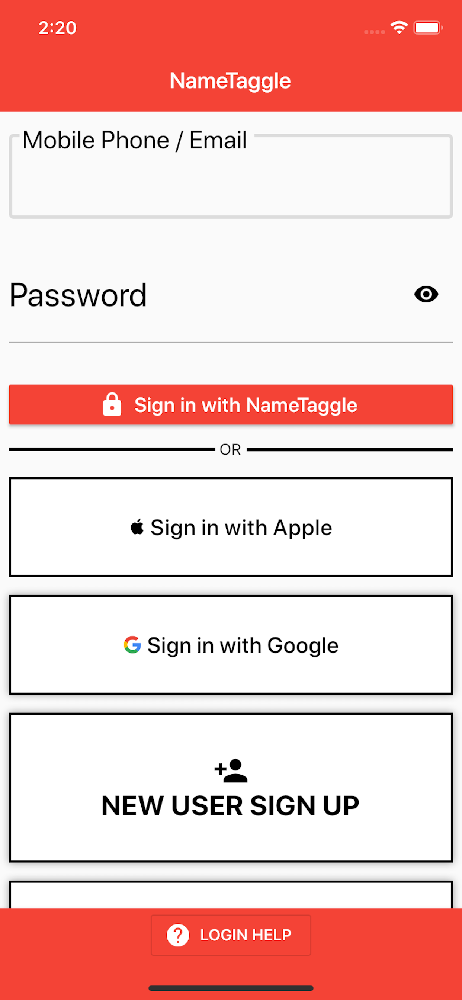

<h1 class="perm-marker">Install & Signup</h1>

 
##### Who should use this procedure?
New users who would like step-by-step instructions to install and setup NameTaggle.

 
##### What should I have ready before I start?
Before you begin make sure you have:
<ul class="release-bullets">
<li> Your smart phone (NameTaggle will send you a verification text message.)</li>
<li>The "Join Code" from the organization you're joining</li>
</ul>

 
##### How do I Install & Sign Up for NameTaggle?
Follow these steps to install and sign up with NameTaggle:
<table class="procedure-table">
  <tr>
    <th>Step</th>
    <th>Description</th>
    <th>Help</th>
  </tr>
  <tr>
    <td class="step-num">1</td>
    <td class="description">Download and install the app for your phone.
    
    Hint: You can tap the logo's in the help section to go to NameTaggle in the store.
    </td>
    <td class="help">
      
       
      
    </td>
  </tr>
  <tr>
    <td class="step-num">2</td>
    <td class="description">Open the app and tap the "NEW USER SIGN UP" button.

    
    Hint: New installs will provide a wizard.  You can sign up with Google, Apple or create an unlinked account from the wizard or the login screen.

    
    Hint: Screens may differ between Android and iPhone.

    
    Hint: For most Apple users, the best option is to sign-in with Apple.  For most Android users, the best option is sign in with Google.

    </td>
    <td class="help">
    

    
    Hint: New installs will provide a wizard that looks like this:
    

</td>
  </tr>

  <tr>
    <td class="step-num">3</td>
    <td class="description"> Tap the two sliders if you agree with the End User License Agreement (A) and attest you are 13 years old or older (B).</td>
    <td class="help"></td>
  </tr>

  <tr>
    <td class="step-num">4</td>
    <td class="description">Enter your mobile phone number(A) and tap "NEXT"(B). (NameTaggle will send you a test Message.)

    
    Hint: You cannot reuse this phone number with a different account.
    </td>
    <td class="help"></td>
  </tr>

  <tr>
    <td class="step-num">5</td>
    <td class="description">Enter the 6 digit code from the text message NameTaggle Just sent(A) and tap "NEXT"(B).  
    
    Hint: If you typed the wrong phone number, you can go back to the previous step by tapping the "1" circle, re-enter your number and a "RESEND" button will appear. </td>
    <td class="help"></td>
  </tr>

  <tr>
    <td class="step-num">5</td>
    <td class="description">Enter First Name (A), Last Name (B), and email address (C). Then tap the "NEXT" button (D).
    
      Hint: You cannot reuse this email with a different account
    

    </td>
    <td class="help"></td>
  </tr>

  <tr>
    <td class="step-num">6</td>
    <td class="description">Enter your password (twice A,B) and tap "CREATE" (C).

     
      
        Hint: NameTaggle will let you correct any errors and try again.
      
    </td>
    <td class="help"></td>
  </tr>

  <tr>
    <td class="step-num">8</td>
    <td class="description">NameTaggle will take you to a list of organizations. Scroll until you find your organization and tap the logo.
     
    
      Hint: You can tap the magnifying glass in the top right corner to search by name.
      

    </td>
    <td class="help"></td>
  </tr>

  <tr>
    <td class="step-num">9</td>
    <td class="description">
      Verify you found the correct organization and tap the "JOIN" button.
    </td>
    <td class="help"></td>
  </tr>

  <tr>
    <td class="step-num">10</td>
    <td class="description"> Enter your organization's join code (A) then tap the "OK" button (B).
     
    
      Hint: You probably received this with the NameTaggle invitation/announcement.
      
       
    
      Hint: If something doesn't work, NameTaggle will let you correct any errors and try again.
    
    </td>
    <td class="help"></td>
  </tr>

  <tr>
    <td class="step-num">11</td>
    <td class="description"> END OF PROCEDURE - Congratulations! you've completed the install and signup for NameTaggle.  You should see your dashboard screen if your join code was correct. You're now ready to <a href="/procedures/020-ProfileSetup/">setup your profile</a>.
     

    </td>
    <td class="help"></td>
  </tr>

</table>

 
##### Additional Resources
You may also be interested in:
<ul class="release-bullets">
<li>The <a href="/about/">story</a> of NameTaggle</li>
<li><a href="/procedures/020-ProfileSetup/">Setting up your profile</a> in NameTaggle</li>
<li>Setting up a family in NameTaggle</li>
<li>Joining Groups in NameTaggle</li>
</ul>
