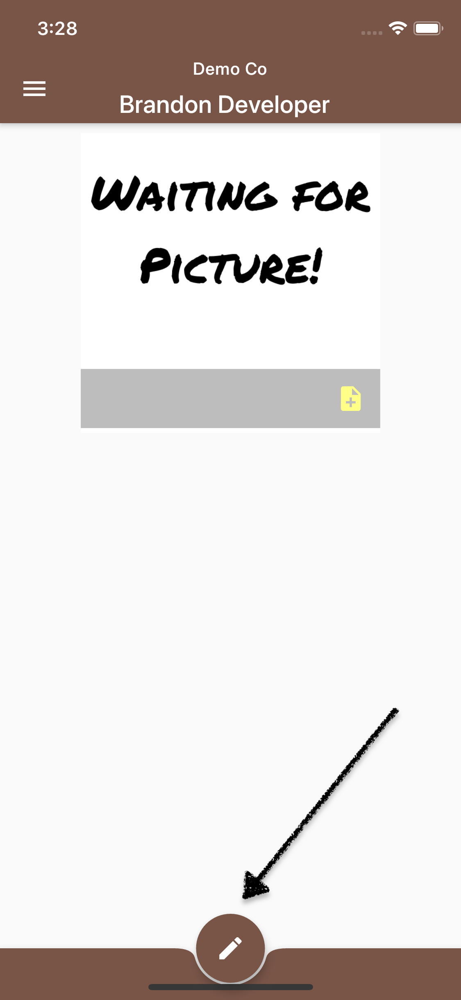

<h1 class="perm-marker">Individual Profile Setup B</h1>

 
##### Who should use this procedure?
Users who have completed installation/signup and would like step-by-step instructions to setup their individual profile in NameTaggle.

 
##### What should I have ready before I start?
Before you begin make sure you have:
<ul class="release-bullets">
<li> Your smart phone with <a href="/procedures/010-NewUserSignup">NameTaggle installed and signed into your account</a>.</li>
<li> A picture of yourself (You can crop a digital picture from your phone or take a selfie during setup.)</li>
</ul>

 
##### How do I setup my individual profile in NameTaggle?
Follow these steps to setup your individual profile in NameTaggle:
<table class="procedure-table">
  <tr>
    <th>Step</th>
    <th>Description</th>
    <th>Help</th>
  </tr>

  <tr>
    <td class="step-num">1</td>
    <td class="description">From your dashboard, tap on your profile picture.
     
    
      Hint: After you signup, your profile picture says "WAITING FOR PICTURE".
    
     
      
        Hint: You can always return to your dashboard by tapping on the hamburger menu () in the upper left of the application and then the first menu option "Dashboard".
      
    </td>
    <td class="help">
    
    </td>
  </tr>

  <tr>
    <td class="step-num">2</td>
    <td class="description"> Tap on the "EDIT" button (pencil icon).

    </td>
    <td class="help">
    
    </td>
  </tr>

  <tr>
    <td class="step-num">3</td>
    <td class="description">Tap on the current picture.
      
        Hint:
      
    </td>
    <td class="help">
    
    </td>
  </tr>

  <tr>
    <td class="step-num">4</td>
    <td class="description">NameTaggle will present a popup selction menu. choose one:
    <ul>
      <li>Camera - Take a new selfie.</li>
      <li>Gallery - Select a previous photo from your photo collection.</li>
      <li>Other Files - Other locations like cloud storage.</li>
    </ul>
      
        Hint:
      
    </td>
    <td class="help">
    
    </td>
  </tr>

  <tr>
    <td class="step-num">5</td>
    <td class="description">After selecting/taking a picture, you'll have the opportunity to crop a picture.
      
        Hint: Android and iPhone cropping looks slightly different.
      
    </td>
    <td class="help">
    
    </td>
  </tr>

  <tr>
    <td class="step-num">6</td>
    <td class="description"> Tap the Save button to see how other people will see your profile.
      
        Hint: You can continue editing your profile, but don't forget to save your changes
      
    </td>
    <td class="help">
    
    </td>
  </tr>

  <tr>
    <td class="step-num">#</td>
    <td class="description">_
      
        Hint:
      
    </td>
    <td class="help">
    </td>
  </tr>

</table>

 
##### Additional Resources
You may also be interested in:
<ul class="release-bullets">
<li>The <a class="" href="/about/">story</a> of NameTaggle</li>
<li><a href="/procedures/010-NewUserSignup">Install and Signup</a> for NameTaggle Procedure</li>
<li>Setting up a family in NameTaggle Procedure</li>
<li>Joining a Group in NameTaggle Procedure</li>
</ul>
